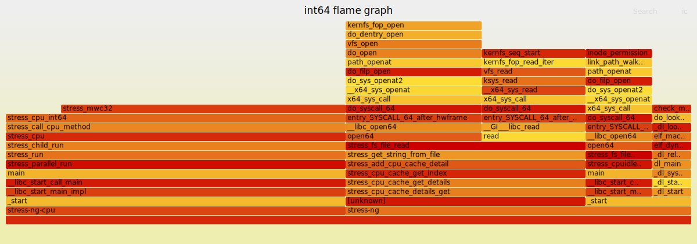
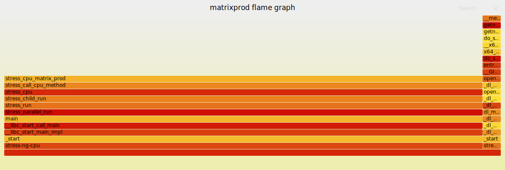
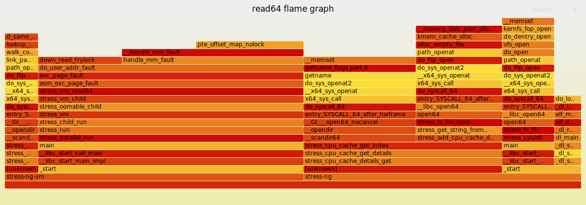
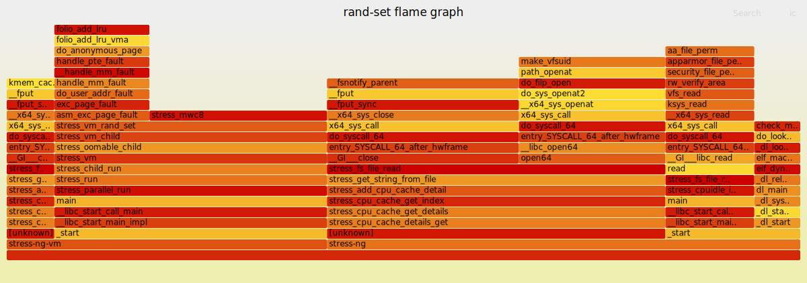
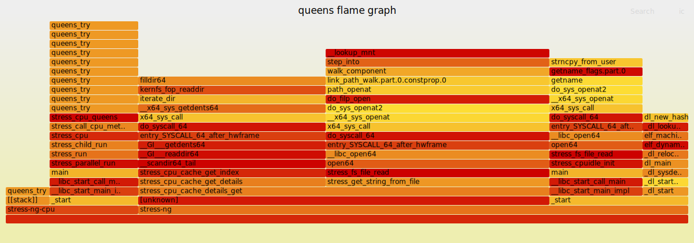

# 火焰图生成与热点分析

本目录对应题目一的第二小题：使用 `perf record` + FlameGraph 工具链，对题目中的典型负载生成 CPU 火焰图，并完成热点分析与对比说明。

本文档按考题要求组织，既可作为运行说明，也可作为后续整理 `report.pdf` 的文字底稿。

## 目录说明

```text
task1/2-flamegraph/
├── README.md
├── flamegraphs/
│   ├── int64_flame.svg
│   ├── matrixprod_flame.svg
│   ├── read64_flame.svg
│   ├── rand_set_flame.svg
│   ├── queens_flame.svg
│   └── ...
└── report.pdf
```

本题考题要求“至少 2 种负载”，但为了让后续分析更完整，建议五种负载全部生成：

1. 纯计算（整数）：`int64`
2. 纯计算（浮点/矩阵）：`matrixprod`
3. 连续访存：`read64`
4. 随机访存：`rand-set`
5. 分支密集：`queens`

这样可以把第一小题里的五类负载和第二小题的火焰图结果一一对应起来，写报告时也更自然。

## 环境准备

建议安装以下依赖：

```bash
sudo apt update
sudo apt install -y linux-tools-common linux-tools-generic linux-tools-$(uname -r) stress-ng git perl binutils elfutils
```

检查工具：

```bash
perf --version
stress-ng --version
perl -v
```

如果当前系统限制了 `perf` 使用权限，可先检查：

```bash
cat /proc/sys/kernel/perf_event_paranoid
cat /proc/sys/kernel/kptr_restrict
```

若权限限制较严，可临时放宽：

```bash
sudo sysctl -w kernel.perf_event_paranoid=1
sudo sysctl -w kernel.kptr_restrict=0
```

## 降低 `[unknown]` 的准备工作

火焰图中大量 `[unknown]` 通常来自两类问题：

1. 用户态程序缺少符号信息，`perf` 只能看到地址，无法解析到函数名。
2. 调用栈展开失败，常见于程序编译时省略 frame pointer，而采样时仍使用默认 `-g`。

本 README 后续命令统一使用 DWARF 调用栈：

```bash
--call-graph dwarf
```

它比默认 `-g` 更适合处理省略 frame pointer 的用户态程序。若仍然看到 `/usr/bin/stress-ng` 下有大量 `[unknown]`，说明系统自带的 `stress-ng` 可能被 strip，可优先使用带符号版本：

```bash
# 方案一：如果系统提供 dbgsym/debug 包，安装 stress-ng 的调试符号
sudo apt install -y stress-ng-dbgsym

# 方案二：从源码编译带符号和 frame pointer 的 stress-ng
cd ~/task/task1/2-flamegraph
git clone https://github.com/ColinIanKing/stress-ng.git
cd stress-ng
make CFLAGS="-O2 -g -fno-omit-frame-pointer"
./stress-ng --version
```

如果 `stress-ng-dbgsym` 提示找不到包，说明当前系统没有启用对应调试符号源，直接采用方案二即可。若采用源码编译版本，后续命令统一使用 `./stress-ng/stress-ng`，不要使用系统路径下的 `/usr/bin/stress-ng`。

## FlameGraph 工具准备

如当前目录下还没有 FlameGraph 仓库，可执行：

```bash
cd ~/task/task1/2-flamegraph
git clone https://github.com/brendangregg/FlameGraph.git
```

如果仓库已经存在，则无需重复 clone。

## 采集与出图流程

统一流程如下：

1. `perf record --call-graph dwarf` 采样
2. `perf script` 导出调用栈
3. `stackcollapse-perf.pl` 折叠栈
4. `flamegraph.pl` 生成 SVG

为了避免默认 `perf.data` 在多次实验中相互覆盖，建议显式指定原始采样文件名。

## 五类负载统一生成方案

建议统一在当前目录下执行，所有原始采样文件、导出文本和折叠栈文件都单独命名，避免互相覆盖。

### 1. 纯计算（整数）`int64`

采样命令：

```bash
cd ~/task/task1/2-flamegraph
perf record -F 99 --call-graph dwarf -o int64.perf.data -- \
./stress-ng/stress-ng --cpu 1 --cpu-method int64 -t 30s
```

导出调用栈：

```bash
perf script -i int64.perf.data > int64.perf
```

折叠栈：

```bash
./FlameGraph/stackcollapse-perf.pl int64.perf > int64.folded
```

生成火焰图：

```bash
./FlameGraph/flamegraph.pl --title "int64 flame graph" int64.folded > flamegraphs/int64_flame.svg
```

检查符号解析质量：

```bash
grep -c '\[unknown\]' int64.folded
```

### 2. 纯计算（浮点/矩阵）`matrixprod`

采样命令：

```bash
cd ~/task/task1/2-flamegraph
perf record -F 99 --call-graph dwarf -o matrixprod.perf.data -- \
./stress-ng/stress-ng --cpu 1 --cpu-method matrixprod -t 30s
```

导出调用栈：

```bash
perf script -i matrixprod.perf.data > matrixprod.perf
```

折叠栈：

```bash
./FlameGraph/stackcollapse-perf.pl matrixprod.perf > matrixprod.folded
```

生成火焰图：

```bash
./FlameGraph/flamegraph.pl --title "matrixprod flame graph" matrixprod.folded > flamegraphs/matrixprod_flame.svg
```

检查符号解析质量：

```bash
grep -c '\[unknown\]' matrixprod.folded
```

### 3. 连续访存 `read64`

采样命令：

```bash
cd ~/task/task1/2-flamegraph
perf record -F 99 --call-graph dwarf -o read64.perf.data -- \
./stress-ng/stress-ng --vm 1 --vm-bytes 1G --vm-method read64 --vm-keep -t 30s
```

导出调用栈：

```bash
perf script -i read64.perf.data > read64.perf
```

折叠栈：

```bash
./FlameGraph/stackcollapse-perf.pl read64.perf > read64.folded
```

生成火焰图：

```bash
./FlameGraph/flamegraph.pl --title "read64 flame graph" read64.folded > flamegraphs/read64_flame.svg
```

检查符号解析质量：

```bash
grep -c '\[unknown\]' read64.folded
```

### 4. 随机访存 `rand-set`

采样命令：

```bash
cd ~/task/task1/2-flamegraph
perf record -F 99 --call-graph dwarf -o rand_set.perf.data -- \
./stress-ng/stress-ng --vm 1 --vm-bytes 512M --vm-method rand-set -t 30s
```

导出调用栈：

```bash
perf script -i rand_set.perf.data > rand_set.perf
```

折叠栈：

```bash
./FlameGraph/stackcollapse-perf.pl rand_set.perf > rand_set.folded
```

生成火焰图：

```bash
./FlameGraph/flamegraph.pl --title "rand-set flame graph" rand_set.folded > flamegraphs/rand_set_flame.svg
```

检查符号解析质量：

```bash
grep -c '\[unknown\]' rand_set.folded
```

### 5. 分支密集型 `queens`

采样命令：

```bash
cd ~/task/task1/2-flamegraph
perf record -F 99 --call-graph dwarf -o queens.perf.data -- \
./stress-ng/stress-ng --cpu 1 --cpu-method queens -t 30s
```

导出调用栈：

```bash
perf script -i queens.perf.data > queens.perf
```

折叠栈：

```bash
./FlameGraph/stackcollapse-perf.pl queens.perf > queens.folded
```

生成火焰图：

```bash
./FlameGraph/flamegraph.pl --title "queens flame graph" queens.folded > flamegraphs/queens_flame.svg
```

检查符号解析质量：

```bash
grep -c '\[unknown\]' queens.folded
```

## 图像嵌入位置

提交报告前，可在本文件或 `report.pdf` 底稿中直接嵌入 SVG。

### 1. `int64` 火焰图

```md

```

### 2. `matrixprod` 火焰图

```md

```

### 3. `read64` 火焰图

```md

```

### 4. `rand-set` 火焰图

```md

```

### 5. `queens` 火焰图

```md

```

## 热点函数标注要求

考题要求标注“热点函数（占比最大的函数栈）”。建议按以下格式写：

```md
- 热点函数栈 1：`[stress-ng] -> <function>`，约占 xx%
- 热点函数栈 2：`<syscall> -> <kernel path>`，约占 xx%
- 热点函数栈 3：`<memory fault path>`，约占 xx%
```

如果图中热点主要表现为 `[unknown]`，也要如实说明，并解释：

- 用户态主循环符号未完全解析
- 采样中仍可看到部分系统调用、动态链接或缺页处理路径
- 这会导致火焰图中真正的计算热点被压缩到 `[unknown]` 下

## 分析模板

下面这部分可以直接作为 `report.pdf` 的分析框架使用。

### 一、`int64` 火焰图分析

建议从以下角度展开：

1. 宽度分布
`int64` 属于纯整数计算负载，通常热点集中在少量用户态计算路径上，整体会表现为较集中的塔状结构。

2. 主要 CPU 时间消耗
如果热点集中在整数运算相关路径，说明该负载主要受 ALU 执行单元和流水线吞吐能力影响。

3. 若出现系统路径
若图中夹杂 `openat`、`mprotect`、`page fault` 等函数，通常属于程序启动、动态链接或首次触页阶段，而不是整数运算主循环本身。

### 二、`matrixprod` 火焰图分析

建议从以下角度展开：

1. 宽度分布
`matrixprod` 通常以少数热点为主，火焰图宽度更集中，整体更接近“尖塔”形态。

2. 主要 CPU 时间消耗
若热点集中在 `stress-ng` 用户态计算路径，说明该负载主要受算术执行单元、流水线吞吐和 SIMD/浮点执行能力影响。

3. 若出现内核态函数
如果图中出现了 `openat`、`mprotect`、`page fault`、`copy_page`、`clear_page_erms` 等，通常不是矩阵乘法主循环本身，而是：
- 动态链接器初始化
- 页表建立
- 写时复制
- 内存权限调整
- 启动阶段文件访问

这些路径通常出现在程序启动初期或首次触页阶段。

### 三、`read64` 火焰图分析

建议从以下角度展开：

1. 宽度分布
`read64` 更偏向连续大块内存读取，热点通常仍然比较集中，但比纯计算型更容易出现访存辅助路径。

2. 主要 CPU 时间消耗
如果图中出现更多内存访问、页管理或缓存相关辅助函数，说明该负载对缓存层级和内存带宽更敏感。

3. 与随机访存差异
相较 `rand-set`，`read64` 具有更强的空间局部性，理论上更容易被缓存和预取机制利用，因此热点分布通常不会像随机访存那样分散。

### 四、`rand-set` 火焰图分析

建议从以下角度展开：

1. 宽度分布
随机访存负载一般更容易呈现“扁平化”或“多热点分散”的特征，因为 CPU 时间不仅消耗在用户态访问逻辑，也消耗在缓存未命中、地址翻译和访存等待相关路径。

2. 主要 CPU 时间消耗
如果出现更多访存相关函数、缺页路径或内核态辅助函数，说明该负载更依赖缓存层级、TLB 和内存子系统表现。

3. 与计算密集型差异
和 `matrixprod` 相比，`rand-set` 的热点往往更分散，原因是随机访问更容易打破空间局部性和时间局部性，导致流水线后端等待访存返回，热点不再只集中在少量算术函数上。

### 五、`queens` 火焰图分析

建议从以下角度展开：

1. 宽度分布
`queens` 属于分支密集型负载，热点可能分布在递归搜索、条件判断和回溯路径上，集中度通常介于纯计算与访存密集型之间。

2. 主要 CPU 时间消耗
如果图中热点集中在少量搜索函数，说明分支预测器和前端取指/解码效率对性能影响较大。

3. 与纯计算型差异
`queens` 相比 `int64` 或 `matrixprod`，更容易受到分支预测失败、控制流跳转和指令前端效率的影响。

### 六、五种负载横向对比

可直接参考下面的写法：

```md
1. `int64` 和 `matrixprod` 更接近计算密集型，理论上热点更集中，更容易表现为塔状结构。
2. `read64` 和 `rand-set` 更依赖访存子系统，其中 `rand-set` 由于局部性更差，热点通常更分散。
3. `queens` 主要体现控制流和分支预测特征，热点分布通常介于计算密集型和访存密集型之间。
4. 若火焰图出现 `page fault`、`mprotect`、`openat` 等系统路径，通常说明采样覆盖到了程序启动、动态装载或首次触页阶段，而不仅仅是主循环计算阶段。
```

## 结合本机实验现象的说明

在本机对同一种 `stress-ng` 负载重复实验时，即使运行的是同一个负载，生成的两张火焰图仍可能不同。这个现象是正常的，原因主要有：

1. `perf` 采用抽样方式记录，而不是完整记录全部调用。
2. 两次运行时的系统调度、页状态、缓存状态、动态链接阶段时机并不完全一致。
3. 若用户态主循环符号未完全解析，少量额外采样到的 `openat`、`mprotect`、`page fault` 等系统路径会明显改变火焰图形态。

因此，在报告中可以明确写出：

> 即使是同一类负载，火焰图也并非逐次完全一致。差异主要来自抽样统计特性以及运行时系统状态差异，而不是测试负载本身发生了变化。

## 内核态函数出现原因说明模板

如果图中出现了内核态函数，可直接参考以下模板：

```md
火焰图中出现了 `page fault`、`copy_page`、`openat`、`mprotect` 等内核态函数，说明采样不仅覆盖了用户态主循环，也覆盖了程序运行早期的动态装载、文件访问、页表建立和缺页处理阶段。这些路径会带来额外的 CPU 开销，并在短时采样中对热点分布产生显著影响。
```

## 建议写入 report.pdf 的结论

建议将结论压缩为以下三点：

1. 五类负载在火焰图中的热点分布与其微架构特征相对应，计算、访存和分支型负载呈现出不同的热点组织方式。
2. 随机访存型和连续访存型负载更容易显露内存层级、TLB 和缺页路径差异，计算型负载更容易表现为用户态热点集中。
3. 火焰图结果受采样机制和运行时系统状态影响，同一负载多次采样可能存在差异，分析时应结合符号解析质量和实际系统状态综合判断。

## 复现顺序

评审可按以下顺序复现：

```bash
cd ~/task/task1/2-flamegraph
cat README.md
ls flamegraphs
```

若需完整重跑，可依次执行本文中的五组采样命令。
